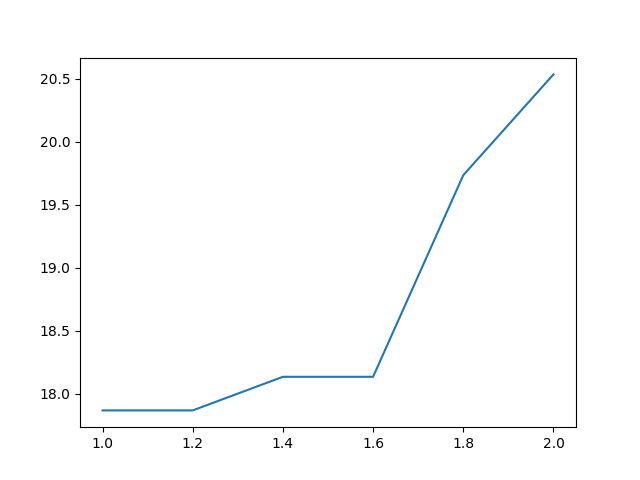

# Naive Bays TV-series classifier

## Usage

1> Fork/Clone this repo  
  
2> In the root project directory, run:  

```bash
$ python3 model/classifier.py [--d smoothing_delta]   # to generate new vocabulary
```

New vocabulary will be saved in model.txt, and the result will be saved in result.txt.  

```bash
$ python3 model/graph.py    # save the plot of different smoothing delta in graph.png
```

Example:
```bash
$ python3 model/classifier.py --d 1.2
$ python3 model/classifier.py --d 2.0
$ python3 model/graph.py
```

Output:  

